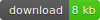
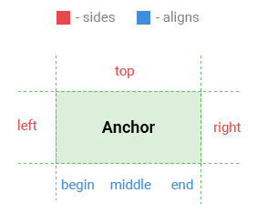
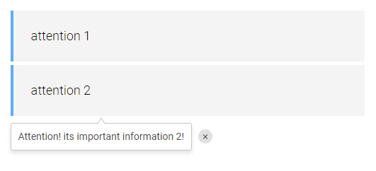

# InfoPopup.js

 [][1]

### Description

Allows to show popup tips

	It works without jquery!

### Settings

| setting     | attribute         | description                                        | default  |
|-------------|:------------------|----------------------------------------------------|:--------:|
| type        | data-type         | sets type of toggle - "hover" or "click"           | "hover"  |
| content     | data-content      | sets content                                       | none     |
| speed       | data-speed        | sets animation duration in milliseconds            | 250      |
| zIndex      | data-zindex       | sets zIndex                                        | 100      |
| side        | data-side         | sets side of popup appearing (top, bottom, left, right) | "bottom" |
| align       | data-align        | aligns along the side (begin, middle, end)         | "begin"  |
| showDelay   | data-show-delay   | sets delay before show in milliseconds             | 0        |
| hideDelay   | data-hide-delay   | sets delay before hide in milliseconds             | 0        |
| hideOnOver  | data-hide-onover  | hides popup when mouse leave the anchor element    | false    |
| closeButton | data-close-button | enables close button                               | false    |
| closeText   | data-close-text   | sets text content to the close button              | none     |
| scrollSense | data-scroll-sense | updates position of the popup when window scroll   | false    |
| className   | data-class        | sets user class to the popup wrapper               | none     |
| onShow      | data-on-show      | function wich trigged when show the popup          | none     |
| onHide      | data-on-hide      | function wich trigged when hide the popup          | none     |
| onReady     | data-on-ready     | function wich trigged when initialize the script   | none     |

### How to use

1. **create** element with attribute **data-infopopup** and define **options as data-** attributes
2. or create element with special class for **using javaScript notation**
3. **connect infopopup.min.js** after the created element or before "body" closing tag
4. following connect common page script and **use InfoPopup API**

### Positioning scheme



### API

You can affect individual elements or groups of them using the special API.  
InfoPopup API provide methods:

- **show(fast)**
- **hide(fast)**
- **toggle(fast)**
- **destroy()** - destroy the popup from the page
- **setSide()** - change the side of the popup appearing
- **setAlign()** - change the popup position on the side

if **fast** is true then popup apear without delay.  
API static method allows to affect the specific elements:

- **getById(id)** - get API object by id of the element

using:

```js
var popup = infoPopup(".attention").setSide("left");

//show special popup without delay
infoPopup.getById("special").show(true);

// destroy the popup
infoPopup.getById("temp").destroy();

```

### Examples

```html
	<div data-info-popup data-content="Attention! its important information!"
	></div>
	<script src="js/infopopup/infopopup.min.js"></script>
	<script src="js/common.js"></script>
```

```js
	var tip = infoPopup(".tip", {
		type        : "click",
		closeButton : true,
		closeText   : "close",
		showDelay   : 250,
		hideDelay   : 250,
		scrollSense : true,
		onShow      : function(){
			// do something ...
		}
	});

```

### Result



-------------
Thank's for using.  
Developed by Ustinov Maxim - [ewclide][2]

[1]: https://github.com/ewclide/info-popup/archive/master.zip  "download"
[2]: https://vk.com/ewclide  "ewclide"